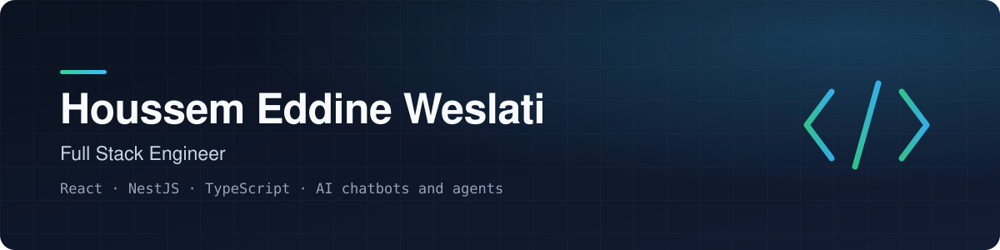

  

  
  
  <!-- When the portfolio is live, uncomment:
  
  -->

 

### About

I build web applications end to end: interface design, front end, API, database, AI features and deployment.
Two years of professional experience, currently the developer of a multi-tenant SaaS running in production.
I came to full stack from data engineering and AI, so I am comfortable from the database to the screen.

`Tunis, Tunisia` &nbsp; `Remote-friendly` &nbsp; `English · French · Arabic`

 

### What I do

<table>
  <tr>
    <td width="33%" valign="top">
      <h4>Full stack web</h4>
      React and Next.js front ends, NestJS and Node.js APIs, PostgreSQL. Typed from the database to the screen, with automated tests.
    </td>
    <td width="33%" valign="top">
      <h4>AI features</h4>
      Chatbots and agents that do real work: retrieval (RAG), function calling, voice, and tools that act inside the product.
    </td>
    <td width="33%" valign="top">
      <h4>Data and delivery</h4>
      Data migrations and pipelines in Python and SQL. Docker, a reverse proxy and tagged releases on a server I run myself.
    </td>
  </tr>
</table>

 

### Stack

  
  &nbsp;&nbsp;
  

  

`OpenAI` &nbsp; `Mistral` &nbsp; `RAG` &nbsp; `Function calling` &nbsp; `ElevenLabs` &nbsp; `Databricks` &nbsp; `Playwright` &nbsp; `WebSockets`

 

### Selected work

Most of my work lives in private repositories owned by the companies I work with. This is what it covers, without the code.

<table>
  <tr>
    <td width="50%" valign="top">
      <h4>Testudo</h4>
      MULTI-TENANT SAAS · IN PRODUCTION
      
ISO 9001 quality management platform, built from the first screen to production: documents, audits, non-conformities, action plans, risks and indicators. Granular access control, real-time updates, PDF and Excel reporting in French and English.

      <code>React 19</code> <code>NestJS</code> <code>TypeScript</code> <code>PostgreSQL</code> <code>WebSockets</code> <code>Docker</code>
    </td>
    <td width="50%" valign="top">
      <h4>QualiBot</h4>
      AI ASSISTANT · RAG
      
The AI assistant inside Testudo, built with a colleague. It answers from ISO 9001 knowledge and the company's own documents, opens documents and navigates the app for the user.

      <code>Python</code> <code>FastAPI</code> <code>Mistral</code> <code>RAG</code> <code>CopilotKit</code> <code>Langfuse</code>
    </td>
  </tr>
  <tr>
    <td width="50%" valign="top">
      <h4>Voice chatbot for accessibility</h4>
      AI CHATBOT · VOICE
      
Voice-enabled chatbot on an e-ticketing website, so that people with disabilities can find information and buy tickets by speaking.

      <code>Python</code> <code>OpenAI</code> <code>ElevenLabs</code> <code>RAG</code> <code>MongoDB</code>
    </td>
    <td width="50%" valign="top">
      <h4>Food ordering agent</h4>
      AI AGENT · FUNCTION CALLING
      
An agent that talks with customers, takes their orders and passes them to the restaurants.

      <code>Python</code> <code>OpenAI</code> <code>Function calling</code> <code>MongoDB</code>
    </td>
  </tr>
  <tr>
    <td width="50%" valign="top">
      <h4>Salesforce data migration</h4>
      DATA ENGINEERING · UK CLIENT · REMOTE
      
Migration of opportunities, quotes and pricing data, with validation and reconciliation after each run.

      <code>Python</code> <code>SOQL</code> <code>Azure Data Factory</code> <code>Databricks SQL</code>
    </td>
    <td width="50%" valign="top">
      <h4>Data migration platform</h4>
      WEB APP · ETL / ELT
      
Platform that generates and schedules data integration jobs across five database engines, with a SQL workspace and data lineage.

      <code>React</code> <code>Python</code> <code>SQL</code>
    </td>
  </tr>
</table>

 

### Activity

  

  Includes work in private repositories.

 

  Open to remote work. The fastest way to reach me is <a href="https://www.linkedin.com/in/houssemeddineweslati">LinkedIn</a> or <a href="mailto:houssemeddine.weslati@gmail.com">email</a>.

